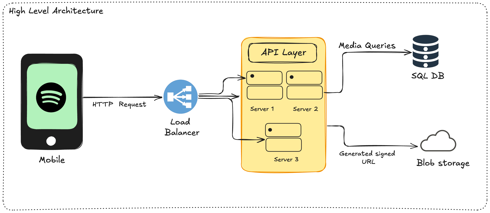
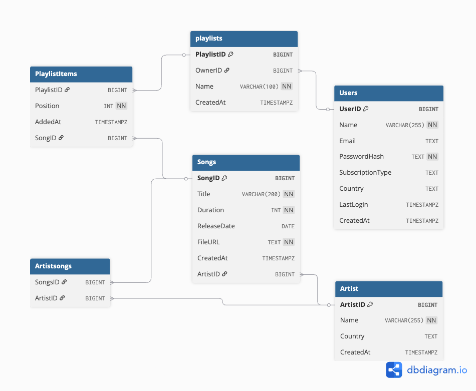
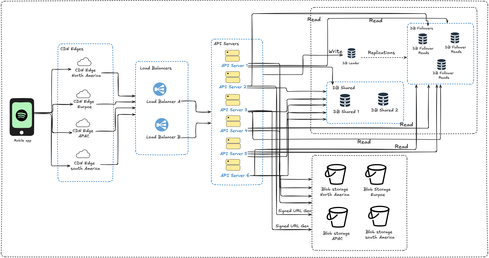

# Spotify System Design

## 1. Requirements and Assumptions

### Requirements:
- **Artists** can **upload their songs**.
- **Users** can **search for and play songs**.
- **Users** can **create and manage playlists**.
- **Users** can **maintain personal profiles**.
- The system should provide **basic monitoring and observability**, including health checks, performance metrics, and error tracking.
### Assumptions:
1. The platform will have approximately **500,000 users**, listening to around **30 million songs**
2. On average, each **song file** (at normal audio quality) will require about **3 MB** of storage.
3. The **audio formats** used will be **Ogg** and **AAC**, with different **bitrates** to support adaptive streaming:
    - **64 kbps** — for mobile data saving.
    - **128 kbps** — for standard quality.
    - **320 kbps** — for premium users.

## 2. Capacity Planning

### Song storage
- 3MB x 30 Million songs ≈ 90 TB of raw data.
- This doesn't include replicas across different regions.
- It also doesn't include versioning overhead when user re-uploads songs.
- The storage might go upto 2-3x times higher.

### Song Metadata
- Each song needs a title, artist references, duration, file URLs etc.
- At roughly 100 Bytes per song, 100 x 30 Million ≈ 3 GB.

### User Metadata
- User profiles, preferences and playlist are ~1kb x 500k = 0.5 GB.

### Daily Bandwidth
- The average listen time is 3.5 minutes at 128-160 kbps, roughly 3-4 mb per stream.
- Let's assume each user streams 10-15 songs daily.
- This leads to significant egress cross.


## 3.  High Level architecture



- We will develop a **web or mobile application** where users can use **Spotify** for listening to songs, managing playlists, and more.
- The application will make **HTTP requests** that are routed through a **load balancer**.
- The **load balancer** will distribute incoming API requests across multiple **API servers**.
- We can use **Round Robin** or **Least Connection** algorithms for load balancing.
- The **API layer** will expose **RESTful APIs**.
- For **request validation and authentication**, we will use **JWT tokens**.
- A **SQL database** will be used to store **metadata**, and the servers will query this data as needed.
- For **audio file storage**, we will use **blob storage** such as **AWS S3** to store the audio files.
- Audio files will be accessed using **generated signed URLs** (URLs expires after some time) generated securely.

## 4. API Design

#### Search and Discovery

1. Search different content types with pagination:
   `GET: /search?q={query}&type=song,artist&limit=20&offset=0`
2. Get Trending songs, optionally filtered by gene
   `GET: /songs/trending?genre={genre}&limit=50`
3. Get all songs by a specific artist
   `GET: /artist/{id}/songs?limit=50`

#### Content Access

1. Get song metadata and streaming URL
   `GET: /songs/{id}`
2. Direct streaming endpoint (alternative to signed URL).
   `GET: /songs/{id}/stream`
3. Get playlist details with an optional song list
   `GET: /playlist/{id}?include_songs=true`

#### User Actions

1. Create a new playlist
   `POST: /playlist`
   Payload:
```
"name": "My favourites",
"is_public": false
```

2. Add a song to playlist
   `PUT: /playlist/{id}/songs`
   Payload:
```
"songs_id": [123, 456, 789, ...],
"position": 5
```

3. Remove a song from playlist
   `DELETE: /playlists/{id}/songs/{songs_id}`

4. Like/ unlink song
   `POST: /songs/{id}/like`

#### User Management

1. Get the current user's playlist
   `GET: /users/me/playlists`
2. Get songs liked by the user
   `GET: /users/me/liked-songs?limit=50?offset=0`
3. Follow an artist:
   `POST: /users/me/follow/{artist_id}`

## 5. Data storage

#### Audio Files
- The audio files are immutable, they are rarely changed once uploaded.
- The audio files can be stored in a sensible folder structure.
  `/artist/{artistID}/album/{albumID}/{songID}.ogg`

#### Metadata
- For storing data in the database, we can use the structure shown in the diagram to organise it properly.



## 6. Scalability (50M Users, 200M Songs)

- Songs Metadata: 100 Bytes x 200 M ≈ 20 GB
- User Metadata: 1 KB x 50 M ≈ 50 GB
- Audio Storage: 3 MB x 200 M ≈ 600 TB



### Elements in the architecture

#### Mobile App:
- The main client used by **users** and **artists**.
- Lets users **play songs**, **create playlists**, and **upload songs**.
- Sends **HTTP requests** to the backend for all actions.

#### CDN Edges (Content Delivery Network)
- These are **servers placed in different regions** (North America, Europe, APAC, South America).
- Their job is to **cache and deliver content** (like songs or images) close to the user.
- Helps reduce **latency** and **improve streaming speed**.

#### 3. Load Balancers
- They sit between the CDN and API servers.
- Their role is to **distribute incoming traffic** evenly across multiple servers.
- Can use methods like **Round Robin** or **Least Connection** to decide which server handles a request.
- Keeps the system **fast and reliable** even when many users are online

#### 4. API Servers
- The **core of the backend** — handle all business logic.
- Validate **JWT tokens**, process **user requests**, talk to the **database**, and **generate signed URLs** for blob storage.
- These servers ensure that every user action (play, upload, analytics) is handled properly.

#### 5. Database (DB) Layer
- Stores **all structured data** like user info, playlists, song metadata, analytics, etc.
- Split into three main parts:
    - **DB Leader** – handles all **write operations** (new songs, playlist updates).
    - **DB Shards** – divide large data sets into smaller parts for better performance and scalability.
    - **DB Followers** – handle **read operations** and are **replicated** from the leader to balance load.

#### **6. Blob Storage**
- Used to store **large files** such as **audio tracks**, **album covers**, or **artist uploads**.
- Distributed across regions (North America, Europe, APAC, South America) for faster access.
- When users play a song, they stream it from the nearest blob storage location.

#### **7. Signed URL Generator**
- Creates **temporary secure links** that allow access to files in blob storage.
- Prevents unauthorized downloads or long-term access to songs.
- Each link expires after a short time to keep files safe.

#### **8. CDN Cache Invalidation**

- When a song or album is **updated or replaced**, old versions in the CDN cache must be removed.
- Cache invalidation ensures users always stream the **latest version** of content.

#### How They Work Together

All these components work like a pipeline:  
**Mobile App → CDN Edge → Load Balancer → API Server → Database / Blob Storage → User.**  
Each part plays a role in making sure songs upload, stream, and update smoothly for millions of users.

## 7. System Read Workflow

1. The **user** taps the **Play** button on the mobile app.
2. The app sends a **request** with the song ID to the **load balancer**.
3. The **load balancer** forwards that request to one of the **API servers**.
4. The **API server** checks if the user’s **JWT token** (login proof) is valid.
5. If valid, the server looks up the **song’s details** in the database.
6. The **database** sends the song information back to the server.
7. The server creates a **signed URL** (a temporary secure link) for the song file.
8. The server sends the **song details** and **signed URL** back to the mobile app.
9. The mobile app uses that signed URL to request **audio chunks** from the **blob storage**.
10. The **blob storage** streams the song to the mobile app.
11. While playing, the app also sends **analytics data** (like play count or duration) back to the server.

## 8. System Write Workflow

1. The **artist** starts uploading a song.
2. The **mobile app** sends a **POST request** with the song file and its metadata to the **load balancer**.
3. The **load balancer** forwards the request to one of the **API servers**.
4. The **API server** first checks the **file format and size** to make sure it meets the upload limits.
5. If the file is valid, the upload continues. If not, the server returns an error response.
6. The **audio file** is then uploaded to **blob storage**.
7. The **API server** extracts **audio metadata** such as duration, bitrate, and title.
8. The **API server** stores both the extracted metadata and the metadata provided in the request into the **database**, linking them to the correct artist and album records.
9. The uploaded file is moved to the appropriate location, 
   for example:  `/artists/${artistID}/album/${albumID}`.
10. The system **invalidates the CDN cache** for that artist or album to ensure updated content is served.
11. Finally, the **server sends a response** back to the mobile app confirming that the song was uploaded successfully.

---


